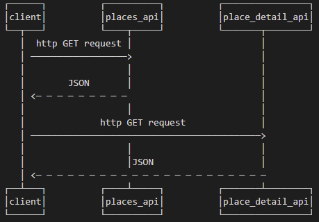

CS361 Individual Project - Pet Finder

Hosting TBD: I have not deployed this yet... but you can go ahead an run it locally, if you're so inclined.

Getting started (steps if you want to run this on your own):
* clone repo
* create a virtual environment: python -m venv venv
* activate the virtual environment: source venv/bin/activate
* install dependencies: pip install -r requirements.txt
* create a file at the root of the project called: "google_api_key" and copy and paste your google "places" api key into the file
* startup flask: flask run

Making requests; this services exposes two API services: places_api and place_detail_api ... accessible through http GET requests:

1. /places_api ... takes three parameters: 
* zip_code
* radius_miles
* keywords (keywords is a comma delimited list, url-encoded "%2C" or not should still work with the flask requests library)
* Example Request: http://127.0.0.1:5000/places_api?zip_code=97116&radius=10&keywords=pets,veterinary

2. /place_detail_api ... takes a single parameter
* place_id (obtained from the /places_api JSON response)
* Example Request: http://127.0.0.1:5000/place_detail_api?place_id=ChIJ21EttP0blVQRG_tD-2j9R6g
NOTE: Careful with the place_detail_api as it does charge per request $0.003 per call (adds up)... which is why this is a separate endpoint (prefer user interaction) and I have not included my google_api_key ;)

Basic UML:

